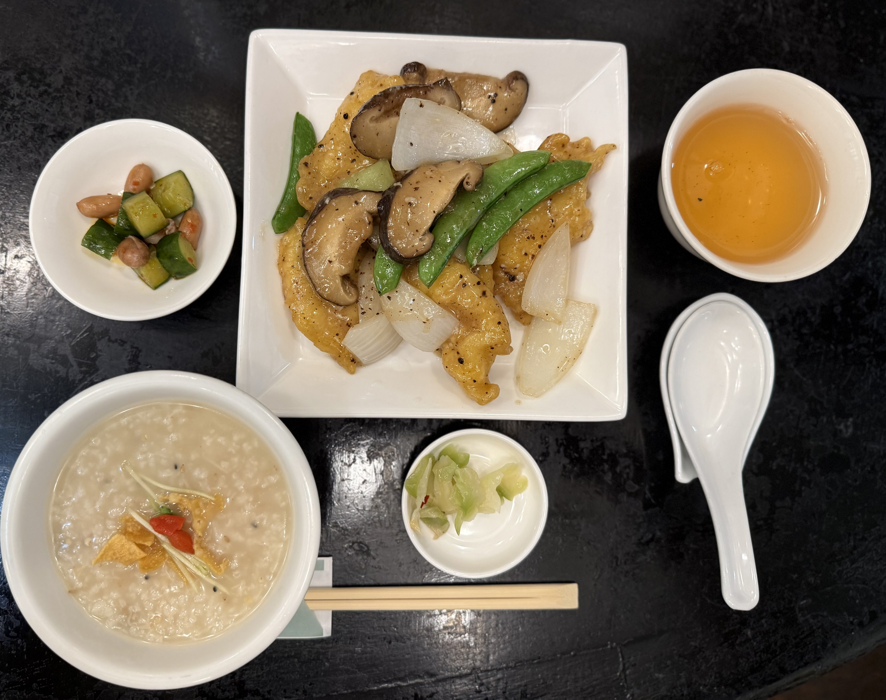

## 回復期、外で何食べていいか問題｜薬膳中華の白身魚炒めはセーフか？

---
**License:** CC BY-NC 4.0  
**Author:** [Rikka](https://github.com/noetic-loop)  
**Details:** [creativecommons.org/licenses/by-nc/4.0](https://creativecommons.org/licenses/by-nc/4.0/)

---
## 🍽 この日の体調と前提条件

- 副腎疲労：ステージ2〜緩やかに回復中  
- カンジダ除菌：3週目（抗生剤＋除菌ハーブ継続）  
- 小麦・乳製品・砂糖：通常避けている  
- 脂質代謝：回復傾向あり  
- 午前中から外出、昼食時はやや空腹  
- サプリ：ビタミンC、マグネシウム、亜鉛（高吸収タイプ）ほか

---

## 🥢 食べたものと構成

- **主菜**：白身魚と玉ねぎ、椎茸、スナップエンドウのトーチ炒め（薬膳中華）  
- **副菜**：胡瓜とピーナッツの辛味和え  
- **漬物**：ザーサイ  
- **主食**：中華粥  
- **飲み物**：ジャスミンティー（ポット）  
- **デザート**：回避  

---

## 🩺 食後の反応と体感

- **症状出現**：食後まもなく軽い胃もたれ（5分以内に自然軽快）  
- **追加ケア**：なし（自然回復）  
- **その他の不調**：なし（眠気・腸の反応も特記なし）

---

## 🧪 分析と考察

- **第一疑い**：亜鉛サプリの胃刺激（食後でも吸収効率が高いため局所的反応）  
- **補助因子**：焼き付け調理・小麦粉（片栗粉ではない可能性）・油の吸収量  
- **組み合わせによる一過性の胃粘膜刺激**が起きたと推定  
- 同じ調理法でも「魚×粉×油」のトリオが負荷を生みやすいことが示唆される

---

## 🧠 所見と今後の選択指針

- 「通った」が「ベスト」ではない  
- 今の体調ならセーフだが、少し前の状態ではNGの可能性  
- 「トーチ炒め」は品ごとの脂質量に差あり、要観察  
- 蒸し系、あっさり系の炒め物（例：鶏とアスパラ）を次回試すのが良策

---

## ✅ 今日の教訓

> Q. 胃に軽い不快感をもたらす組み合わせとして正しいのは？  
> A. 吸収の良すぎる亜鉛 × 油を吸った小麦粉料理（特に空腹時）

---

## 🪧 タグ

#Rikka外食記録 #薬膳中華レポート #胃反応観察　 #サプリ体感記録 #回復期の選択基準

---
## Author: Rikka

分子栄養学・神経免疫・腸内環境などの相互作用を読み解き、回復設計の試行記録を行なっています。  
臨床的な視点と生活の実感をつなぐログを掲載中。

Exploring the intersections of molecular nutrition, neuroimmune pathways, and gut ecology.  
A log connecting lived experience with clinical insight.

[GitHub (EN / JP)](https://github.com/noetic-loop/Rikka)｜[Substack (EN / JP)](https://substack.com/@rikkarikka)｜[note (JP)](https://note.com/rikka202505)

創作活動は「彩葉（AYA Rowan）」名義で行なっています →  
Creative works are published under the name AYA Rowan (彩葉) →  
[GitHub (EN / JP)](https://github.com/noetic-loop/Gut_Kingdom)｜[Substack (EN / JP)](https://ayarowan.substack.com/)｜[note (JP)](https://note.com/ranunculus202504)

---

© Rikka, licensed under CC BY-NC 4.0  
https://creativecommons.org/licenses/by-nc/4.0/
